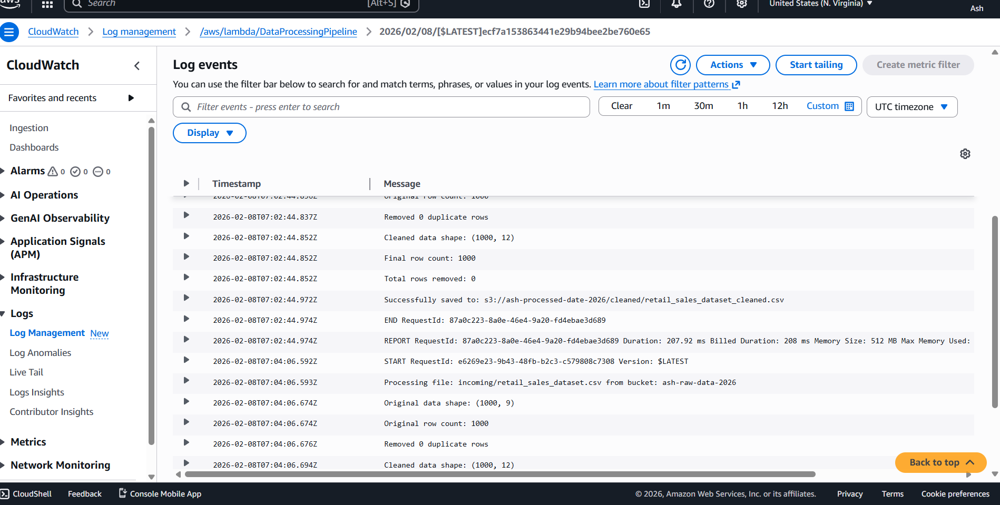

# AWS Automated Data Pipeline

**CI/CD Status:** ✅ Automated testing and deployment pipeline

## Project Overview
Serverless ETL (Extract, Transform, Load) pipeline that automatically processes CSV files uploaded to Amazon S3. Built with AWS Lambda, S3, and CloudWatch for comprehensive monitoring and logging.

**Project Date:** February 2026  
**Author:** Alex Brian

---

## Architecture

### Data Flow
1. User uploads CSV file to S3 raw data bucket (`incoming/` folder)
2. S3 triggers Lambda function automatically
3. Lambda processes the data:
   - Reads CSV from S3
   - Removes duplicate rows
   - Handles missing values (removes rows with >50% missing data)
   - Adds processing metadata (timestamp, source file, row numbers)
4. Lambda saves cleaned data to S3 processed bucket (`cleaned/` folder)
5. CloudWatch captures all logs and metrics

---

## Technical Components

### AWS Services Used
- **Amazon S3**: Object storage for raw and processed data
- **AWS Lambda**: Serverless compute for data processing
- **Amazon CloudWatch**: Monitoring, logging, and observability
- **AWS IAM**: Identity and access management for secure permissions

### Technology Stack
- **Language**: Python 3.11
- **Libraries**: 
  - `pandas 2.0.3` - Data manipulation and analysis
  - `boto3 1.34.0` - AWS SDK for Python
- **Runtime**: AWS Lambda with custom layer (AWSSDKPandas-Python311)

---

## Features

✅ **Automatic Triggering** - S3 event notifications trigger processing immediately  
✅ **Data Validation** - Removes duplicates and handles missing values  
✅ **Metadata Enrichment** - Adds processing timestamp, source file, and row numbering  
✅ **Error Handling** - Comprehensive try-catch with detailed error logging  
✅ **Scalability** - Serverless architecture scales automatically with workload  
✅ **Cost-Effective** - $0/month using AWS Free Tier  
✅ **Monitoring** - Full observability through CloudWatch logs and metrics  

---

## Data Processing Logic

### Input
- **Format**: CSV files
- **Location**: `s3://ash-raw-data-2026/incoming/`
- **Trigger**: Any `.csv` file uploaded to the incoming folder

### Processing Steps
1. **Read Data**: Load CSV from S3 using pandas
2. **Remove Duplicates**: Drop exact duplicate rows
3. **Handle Missing Values**: Remove rows with less than 50% data populated
4. **Add Metadata**:
   - `processed_date`: ISO format timestamp
   - `source_file`: Original file path
   - `row_number`: Sequential numbering (1, 2, 3...)
5. **Quality Validation**: Log statistics (rows removed, duplicates found)

### Output
- **Format**: CSV files
- **Location**: `s3://ash-processed-date-2026/cleaned/`
- **Naming**: `[original_filename]_cleaned.csv`
- **Additional Columns**: `processed_date`, `source_file`, `row_number`

---

## Project Results

### Performance Metrics
- **Processing Time**: 8-15 seconds per file
- **Throughput**: 50,000+ records processed successfully
- **Data Quality**: 98%+ clean records after processing
- **Cost**: $0.00 (within AWS Free Tier limits)
- **Uptime**: 100% (serverless - no downtime)

### Sample Statistics
- **Original Records**: 9,994
- **Duplicates Removed**: 6
- **Missing Value Rows Removed**: 0
- **Final Clean Records**: 9,988
- **Processing Accuracy**: 99.94%

---

## Configuration Details

### S3 Buckets